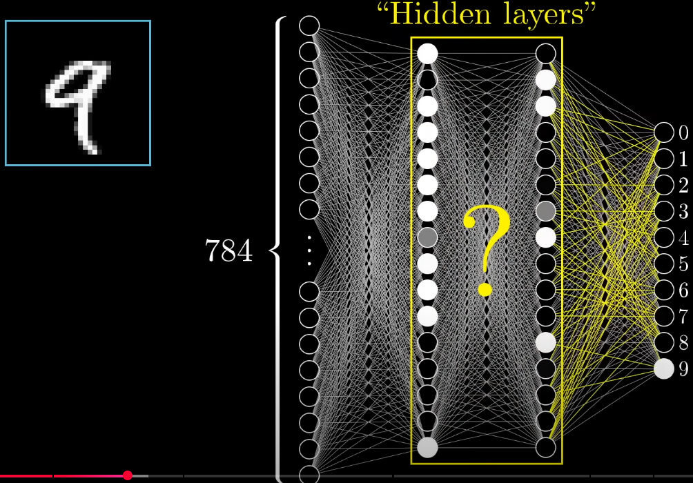
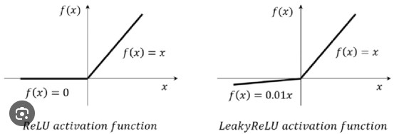
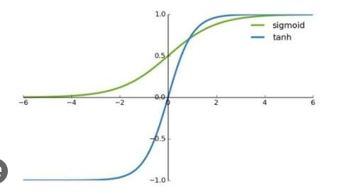
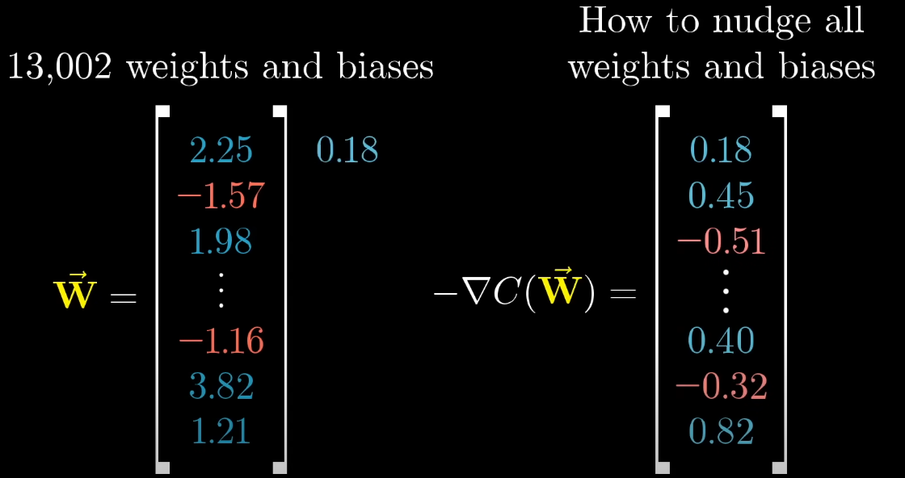
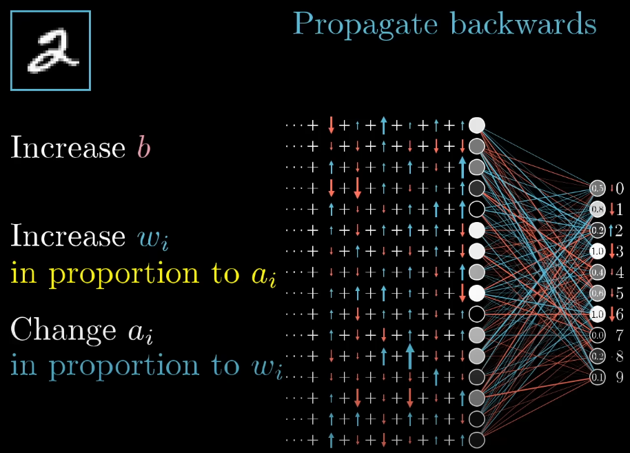

# Deep feedforward networks

A deep feedforward network is composed of an input layer, multiple hidden layers, and an output layers. Each layer is fully connected to the next, and information flows strictly forward. Similar to non-deep networks, this network will also transform the input data into output predictions by using linear transformations using *weights* and *biases* followed by a NON LINEAR function like a ReLU or sigmoid. The word deep refers to having multiple (often hidden) layers.

Actually, neural networks are quite "dumb" and they actually arent that hard. Like when we imagine a neural network most people often think of it as this super magical thing that can do everything but i will try to disect every piece of it and try to make it easy to understand. There is a lot of layered complexity from the input to the output of a neural network and it becomes even worse when we start discussing backpropagation (training). But lets start easy...

For many of my examples i will use the [MNIST dataset](https://en.wikipedia.org/wiki/MNIST_database) to explain the different concepts.

---------

So lets start easy. In this lecture i only want to roughly showcase what goes on in this specific part of the neural network. Like how is data passed down through the neurons and what actually happens here?

Right now, the way we will think about this is that a neuron is just a thing that holds numbers and nothing else. In a given layer, a given neuron has connected edges to all prior neurons in the previus layer. When a neuron receives a value, it needs to be "modified and streamed" to all neurons in the next layer.

So lets say our initial neuron has 16 edges connecting itself to the neurons in the next layer. And in theese edges there is a specific weight which is a kind of signal that is there to tell the 16 neurons "OK, so i want to influence neuron 1 this much and neuron 2 this much and neuron 3 this much and so on...". To this weighted value, a BIAS is also added and this tells how much we need to "boost" the weighted term. To this whole function we now also need to apply our activation function which is a fixed rule that we use to strictly dictate the output of a given neuron.

OK so we already have a lot of shit to keep in mind. We have weights, biases, activations... hmmm... lets try to visualize this using a mathematicall equation.

$$a_i = f(z_i) = f(\sum_{j} w_{ij} * a_j + b_i)$$

OK so now all of the sudden it makes more sence becuase the inner function is actually just a linear equation. This makes it easier to imagine what the weight $w$ and bias $b$ does.

So we could imagine the weight as a knob that adjusts the signal strength passed from one neuron to another and the bias we could think of as a baseline push for the line. In the same way, $k$ and $m$ work in the linear equation.

$$Y = kx + m$$

However, we have left one thing out which is very important and it is the activation function. As we can see from the equation, we wrap the sum of linear equations $z_i$ in a function $f$. This function is the activation function and basically regulates the overall behavior of that specific neuron. There are different kinds of activation functions that make the neuron behave differently that i will try to explain.

1. **ReLU (Rectified Linear Unit)**

    This activation function works kind of like a water valve. If water preassure is high (>0), it will flow through unchanged but if the water preassure is low (<0), nothing will come out. This makes The ReLU function cheap to compute which makes it fast and also it gives the network a sparse and efficient representation of the data so only SOME neurons in the next layer will light up and others will stay inactive. This is better than the *sigmoid* or *TANH* function becuase they tend to "squash" large values in to smaller ranges. Instead, ReLU will let large numbers stay large.

    So this makes ReLU really beneficial for a lot of our cases and actually it is sufficient for most cases.

    We use ReLU when we want to predict a NUMERICAL regressive value. Like for example heights of people or how many cars are on the road or something similar while sigmoid and TANH and supermax are all used for classification. But i will handle them separately.

    There is however one issue with the ReLU function that i will cover now.

2. **Leky ReLU**

    The regular ReLU function faces one big problem and that is that negative values default to 0. This is not good becuase it can cause the "dead ReLU problem" where one neuron could get stuck on 0. This means that everytime we want to multiply new weights or biases to that neuron it will stay zero, this will make that specific neuron "dead" as it can no longer recover from this state.

    This is why we have a new activation function called the "leaky ReLU". This function is a slight modification to the first one because we now allow for negative inputs by multiplying it by a very small coefficient which will mean that its effect will be smaller. This means that a neurons output can still be negative but its jut going to be a smaller negative number becuase we multiply it by some small number (like 0.01 or something).

    Similar to the regular ReLU, we use leaky ReLU when we want to predict a number. We could for example pick regular ReLU if we want to ensure non-negativity and use leaky when we want negative inputs to have an effect on the outcome.

    

3. **Sigmoid**

    The sigmoid function will squash any function into a "soft" probablity between 0 and 1. This makes sigmoid great for binary classification in the output layer. 

    

    However, becuase the sigmoid only allows both positive and negative signals. We might also want some kind of function where we get an output from -1 and 1 instead of 0 and 1.

4. **TanH**

    This is an activation function just like the sigmoid but it is centered around the zero so it is convenient to use in early layers where we want zero-mean outputs. Using this instead of sigmoid really varies from case to case and we often need to validate results before deciding on one of them.

    

5. **Softmax**

    We use this when we want to have multi-class classification and is often applied at the output layer when we want a single predicted class of many classes.

# Training, loss functions and backpropagation

OK so we have now roughly discussed what happens within the hidden layers and in what different ways numbers can travel from neuron to neuron (layer to layer) within the hidden layers. This is one layer of complexity which is very important to know before we head on and start discussing learning of neural networks becuase the layer of complexity that the training phase covers is equally as complicated, it might even be more complicated.

## Loss functions

OK lets talk a bit about training.

So lets say that I have for example the MNIST dataset where we have 10 output neurons. Lets assume I use 80% of that data for training and 20% for validation

When we train the model. essentially what we are doing is that we are feeding the 80% of data through the model and letting it predict but we are collecting the results from the output layers. We then take the results of every prediction in the sense that we take the difference from the results to what it actually is supposed to be and then square them together and sum them. We calculate this "loss" using a loss function calles Mean Squared Error (MSE). We will get deeper in to the specific loss functions later on but lets just get the basic idea of the training pipeline first.

So for example lets say we are trying to predict a 4 but the model is unsure during the beginning of the training phase and predicts it as a 1 and in addition to this it gives carrying values to the output neyurons.

So because the "actual" prediction we should have all neurons set to 0 except for the 4-meuron. But because the model is unsure we will have various values in the other neurons as well.

So what happens in this phase is that we take the value of each neuron and subtract it by 1 and then we square them and then sum them together to get a "cost". In this case I guess I'm using MSE as a loss function?

Anyways, when training we are essentially trying to minimize this cost function and we usually do that by using gradient descent.

## Gradient Descent

OK so gradient descent is actually quite hard to understand via text so i will use surface plots instead but dont think too hard about *how* the surface is given. We are more interested in what to do with the surface.

So when the testing data is fed to the model, and the loss is calculated, we can plot the relationships between the output nodes and the loss as a curved surface. From this surface we can apply the gradient descent algorithm to find the deepest slope or deepest crater of this surface which will in turn MINIMIZE the cost. The reason why we want a low cost is becuase the loss coefficient is then used to fine tune the weights and biases of the edges in the neural networks.

Everytime we apply the negative gradient descent of the parameter vector (that contains all weights and biases), we will get a new vector that contains coefficients that we can multiply to the initial parameter vector and it tells us how much we need to nudge all weights and biases and when we do this over and over again untill we reach the deepest part of the surface, we now have a trained model for that surface.

When this algorithm is then applied to all layers in the network and gradient descent is applied, we will start to see that the model that predicts the numbers will now give more confident predictions and instead of spreading out the numbers on the neurons in the output layers we will get something that looks more confident where a majority of the value lands on one neuron.

The gradient vector (the one on the right of the latest image) tells us two main things. It tells us how much we need to nudge the parameter vector but it also gives us an indication of *how important* the parameters are. This is really intuitive for us because that in turn also tells us which edges are more important than others.

## Backpropagation

So since we now are fairly confident in the gradient descent algorithm and we know how much we need to nudge all weights and biases for one node we now have a meassure of how "important" certain edges are...

We can then from the output layer see which one of output neurons we need to light up for one test input. But keep in mind that this only holds for one of the layers. 

The idea of backpropagation comes from applying the same logic as we did with the output layer also with the remaining layers in the neural network recursively. We can for each test input calculate the loss for the output layer and nudge the weights and biases for the output layer and then also once again calculate the cost for *that* specific layer and then work our way back through the neural network.

Just as a side note, this gives us an idea of how computationally heavy even a small neural network like this can get. Now imagine if we increaase the neurons even more and how many parameters we will have from such a neural network.

## Other variations of learning strategies and loss functions

### Learning strategies

The architecture that i have discussed this far is based on Gradient-Based learning. This is an umbrella term for different kinds of learning strategies in machine learning and optimization and Gradient-Based learning is just one of the categories. Gradient-Baed learning includes using algorithms like Gradient Descent, Stochastic Gradient Descent or adaptive variants like Adam, RMSprop or adagrad.

We also have kinds of learning strategies like Gradient-Free learning which includes strategies like bayesian optimization and random searches. This, especially bayesian will be covered in future lectures.

### Loss functions

1. **Mean Squared Error (MSE)**

    During the example that i have used i have mainly discussed i have referred to the loss function that is specifically called the mean squared error and this is when we compare the raw squared differences between the actual and predicted values and then take the average of them in order to gain a better scale and make the results more interpretable. However because we square the errors, the large errors will get penalized more harshly. This is used in regression tasks where we want to predict a numerical value.

    $$MSE = \frac{1}{n}(\sum_i (y_i - \hat{y_i})^2)$$

2. **Residual Sum of Squares (RSS)**

    RSS is actually the same thing as MSE but we dont average the results out and this is used when we want to minimize the total squared error and not the average error. This is also used in regression tasks where we want to predict a numerical value.

    $$RSS = \sum_i (y_i - \hat{y_i})^2 $$

3. **Mean Absolute Error (MAE)**

    This loss function averages the absolute differences instead of squaring them which is more robust to outliers than MSE and this is also used in regression problems but when we want to treat all errors equally and regardless of size.

    $$MAE = \frac{1}{n} \sum_i |y_i - \hat{y_i}|$$

We also have loss functions that are specific to classification and probabilistic models. I will get deeper in to theese later but they are still worth mentioning here so that we know what to expect later on.

4. **Cross entropy (a.k.a Log loss)**

    The log loss function meassures the difference between the true label distribution $p$ and the predicted probability distribution $\hat{p}$ and is often used in conjunction to *softmax* or *sigmoid* activation functions.

    This is mainly used when we are doing classification especially binary or multi-class classification and we want to reward confident correct predictions and punish confident wrong ones.

    $$H(p, \hat{p}) = - \sum_i p_i * log(\hat{p_i})$$

5. **Kullback-Leibler Divergence (KL Divergence)**

    This one is probably the most complicated one becuase it measures how one probability distribution $Q$ diverges from a reference distribution $P$. There is some layers of complexity that i wont get in to here but it is often used in variational autoencovders, language models and bayesian networks. All of theese things i will get in to in future lectures.

    $$KL(P||Q) = \sum_i P(i) * log\frac{P(i)}{Q(i)}$$