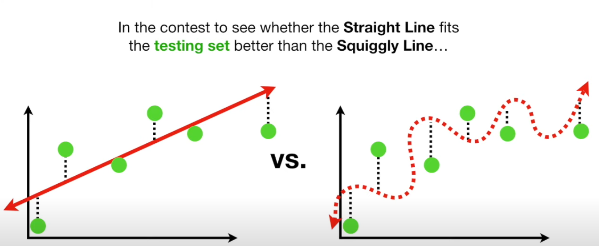

# Regularization

## Bias-Variance tradeoff 

so there is something called the "variance-bias tradeoff" and from my understanding basically what this means is that we can for example have two models...

One is just a simple linear regression model with a straight line but the other model is a high degree curved line that hugs every single training point exactly.

now, in a lot of cases, the linear regression will have a lot of bias because bias is a measure of how well/bad the model fits on training data. And the squiggly line will probably have little to no bias at all but since we also want to take the possibility of overfitting in to account we will want to calculate the variance.

The variance is from my understanding best described as the models ability to generalize its training set on the validation set. So since the straight line linear regression model had high bias it still tried to fit its line on the data as good as it could but since the squiggly line is overfit it can still have high variance because it can not generalize on test data.

So the tradeoff here is that we get really good training results from overfitting but we gett very bad variance because at least for the straight line we might have bias and variance but at least we have a variance that is CONSISTENT!!! BAM DID I JUST NAIL IT LIKE THAT???? 

Just for clarification, here we have the two models i was talking about being fit to training data. As we can see, the left graph shows a lot of bias since it can not fit properly to the curved relationship of the datapoints and the right graph shows a perfectly (over)fit data.


but when we test the model on test data we see that the simple linear regression model generalizes much better. This means that it has LESS variance.



## Regularization

The problem of the bias-variance tradeoff is in summary a problem that we need to take in to account when building a model. Do we want a model with no bias but risk having high variance (perfect learner)? This is also referred to having a very "flexible" model and has a high risk of overfitting.

The methodology of regularization tries to mitigate this problem using three main strategies. I will briefly go through each idea here and then concretely explain each technique.

1. **Strategy 1: Restricting the model flexibility**

    The first strategy is about controlling the model complexity and making it "less powerfull" so it can not overfit on the training data. This strategy roughly contains 3 sub-techniques.

    1. **Parameter norm penalties (a.k.a. L1 or L2 regularization)**

        **OK so lets first talk specifically about L2 regularization and understand it fully becuase it will be easy to infer that knowledge to help understand L1 regularization.**

        So... L2 regularization, also known as "Ridge regression" is when we penalize the model by adding something known as a penalty term to the function. The whole idea of this is to initially force bias on the training phase to the model in hopes that that it will generalize better on testing data and reduce variance. Now this might sound counter-intuitive at first, like why would we want to forcefully make the model worse? Well... let me explain using a simple graph here.

        

        Lets imagine for a moment that we have the 2 red dots for training data and we want to fit a simple linear regression function as a model to it, which is the red line. Now, as we can see the model is perfectly fit on our training data and we have no bias at all. However, when we introduce our model to the training data (green dots) we will have a very ill fitting model that has a lot of variance. This circles back to the *bias-variance tradeoff* i previously explained.

        This is the function for the penalty term:

        $$(residuals) + (\lambda * slope^2)$$

        where lambda is a constant the determines the "power" of the penalty term.

        But when finding a new slope for the training data (using Cross Validation) to test out different values for the penalty term we find a new line that is the blue line in the graph. As we can see, this model has much less variance for the testing data which is good. We can now see that forcing bias in the training phase can improve the long-term reliability of the model.

        Lets also better understand this by plugging in some values, theese are the parameters for the models.

        $$Red = y = kx + m = 1.3x + 0.4$$
        $$Blue = 0.8x + 0.9$$

        When plugging this in to our we can see quite a big relative difference in total cost. Note that the residuals for the red line is 0 because the line is perfectly fit on the red dots. We will also choose $\lambda = 1$ for this example

        $$cost_{red} = (residuals) + (\lambda * slope^2) = 0 + (1 + 1.3^2) = 1.69$$
        $$cost_{blue} = (0.3^2 + 0.1^2) + (1 * 0.9^2) = 0.74$$

        As we can see, the total cost for the blue line is smaller than for the red line, BAM!

        One thing that is interesting about this is that as we have a higher and higher $\lambda$, the slope will be smaller and smaller. This tells us that L2 regularization discourages slopes and tries to "flatten" the model along the X-axis and sacrifices a good initial fit to avoid overfitting in the long run.

        **Now, since we know about how L2 regularization, it will be easy to adopt this knowledge to understand L1 regularization**. They are very simillar to each other but there are also some very important differences that we need to know.

        In order to see directly the most important difference we will look at the equation for the total cost of the line.

        In L2 (ridge regression), the loss can be defined as:

        $$Loss = (residuals) + (\lambda * slope^2)$$

        But in L1 (Lasso regression), the total loss can be defined as:

        $$Loss = (residuals) + (\lambda * |slope|)$$

        Note that instead of squaring the slope, we take the absolute value of the slope and multiply it by our lambda. Remember that for L2 regularization, when we increase $\lambda$ and it approaches infinity, the ridge regression line slope will converge to 0 but it will never fully reach 0. But for L1 regularization, when we let $\lambda$ increase to 0, the total Lasso regression line slope *can* reach 0.

        This difference is important because lets say if we have a very large model and we have a lot of features in our data. The L1 regularization (lasso regressionn) will automatically eliminate the irrelevant features by setting their weights to 0 and we will get a sparser model with only our important features. This is great for intepretability becuase it tells us more clearly which features are important and it reduces overfitting. This means that we want to use L1 for example when doing feature selection and we think/know that only some features are important but we can use L2 if we know that all features are important and we dont want to set weights to 0 and only "shring them".

        **2. Norm penalties as constraints**

        I would dare to say that Norm penalties (and under-constrained problem that i will conver later) is very similar but honestly not as relevant as L1 and L2 regularization. This is becuae regularization is easy to implement becuase we just add the penalty term and it doesent need to be "perfect" becuase even a lousy implementation of it can drastically reduce variance.

        Norm constraints on the other hand is harder to optimize and less flexible becuase it sets hard limits on the training phase which can be hard to enforce and quite frankly might be too radical in a lot of cases. In norm constraint we are basically explicitly constraining the size and influence that the weights of the model have while in L1 and L2 regularization, we can instead "rubber band" the model, so we dont explicitly restrict it and make a bad weight invalid but we penalize it by adding the penalty term which still allows for some flexibility while also reducing variance. 

        Becuase in a lot of practicall cases, where we have a lot of weights, what if the constraint is just too tight? This can cause the model to actually overfit. The use case of this can be if we really want to prioritize model compression or include some formal guarantees that the model wont expand beyond a certain point but even then, soft penalites can be used in a lot of cases.

1. **Strategy 2: Restricting the training process**

    This strategy doesent limit the powers model directly but rather handles how the model trained to prevent overfitting. Of course, there are also at least like 2-3 specific techniques for this but they are kind of more "practicall" in a sense. Like they arent as "mathy" as **strategy 1** but can still be tricky sometimes.

    1. **Early stopping**

        OK so in this explanation i will not even show the data points because this is not what Strategy 2 cares about. The Strategy 2 category only cares about the training process it self, and in this category, *early stopping*, is probably the most widely used and most efficient regularization technique.

        

        So lets imagine we have a model (any kind of model) that we are making training iterations of, this is also called *epochs*. Now, we have a hard time actually choosing how many epochs or how much training we should feed to the model to make it well generalized. Becuase if we train too little, we have an underfit model but if we train too much we will have an overfit model. We can see this from the Validation error decreasing drastically for the initial validation data and then slowly increasing again when the model gets overfit.

        But we can see a point or region in the plot where the validation error reaches a minimal point, THIS is the perfect amount of training epochs that we are aiming for in order to get a well fit model. The process of halting the training process in order to go back in time and capture the hyperparameters of the model that was trained at THAT point is what is known as **early stopping**.

        For this, we need a separate validation set and some metric to base the early stopping on. This is already a given since this is what we have in regular training anyways.

        But in order to not train for an unknown amount of time, we want to capture the metric in real time and then record at what time the metric stops improving and getting worse. This is why we want to capture how many times the metric is worse. When the metric gets worse for a set amount of epochs, we stop the training the process and go back and capture the model with the best metric. This is what we call "**Patience**".

        This is some pythonic pseudocode that roughly describes the early stopping mechanism.

        ```python
        For e in range(epochs):
            loss = model.run_iteration()
            if loss < best:loss:
                model.save()
                best_loss = loss
        ```

    2. **Dropout**

        So dropout method kind of reminds me of the L1 "lasso" regularization in a sense that dropout randomly "drops" some neurons in the network for each epoch. Each neuron in the network is given a probability $p$ to get dropped. This is done independently for each neuron and iteration/epoch. 
        
        Neurons that survive are kept with probability $1-p$, and this variable is often called the "keep-probability". Becuse the output layer sees less total activation on average. To keep the expected output balanced, we scale the surviving neurons by $\frac{1}{keep\_prob}$

        Lets say for example the output layer before dropout is:

        [0.5, 1.2, 0.8, 0.3]

        Then, during training, dropout with $keep\_prob = 0.5$ might give:

        [1.0, 0.0, 1.6, 0.0]

        Neurons 2 and 4 were dropped and the others were scaled by $\frac{1}{0.5} = 0.5$ in order to maintain expected activation. This scaling is useful and important becuase at validation we want to use the full network so no neurons are dropped so we want the outputs at training and testing to be comparable in magnitude, this is why we scale during training. 