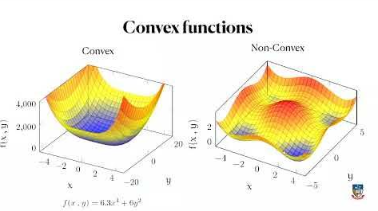
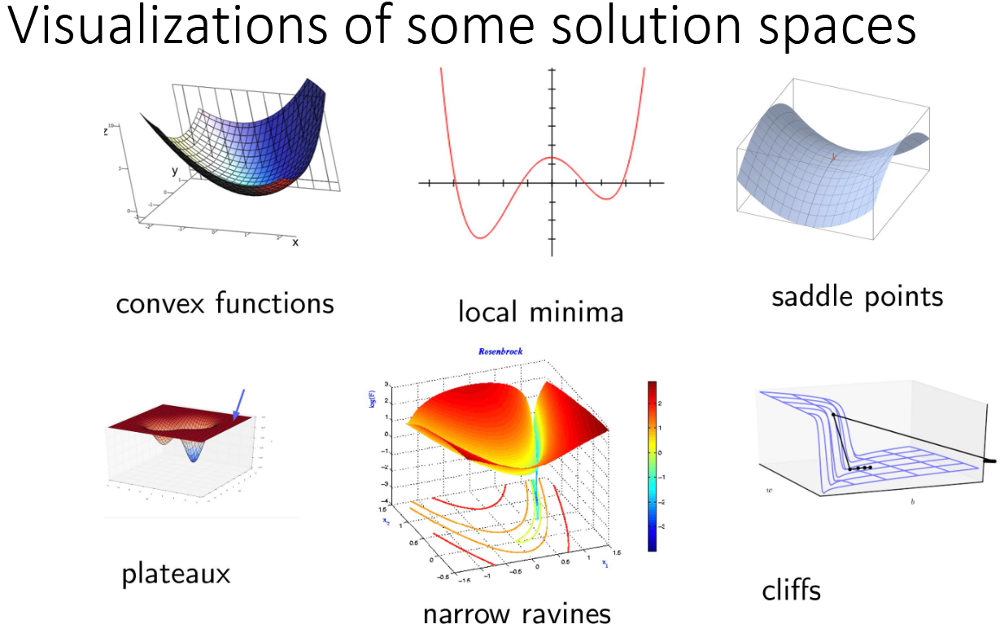
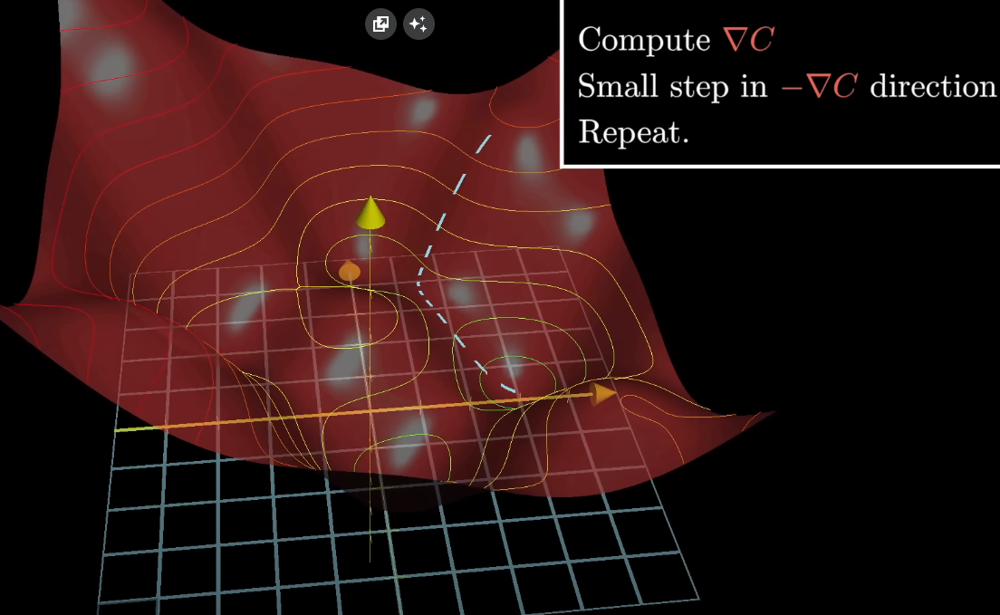
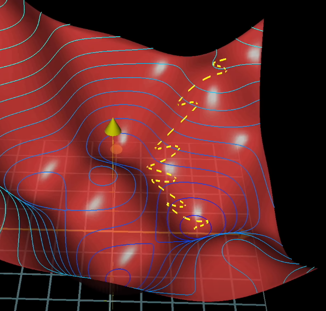
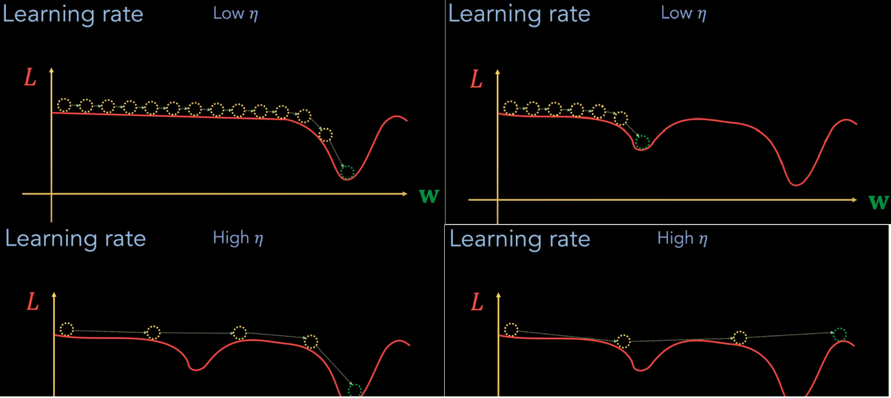
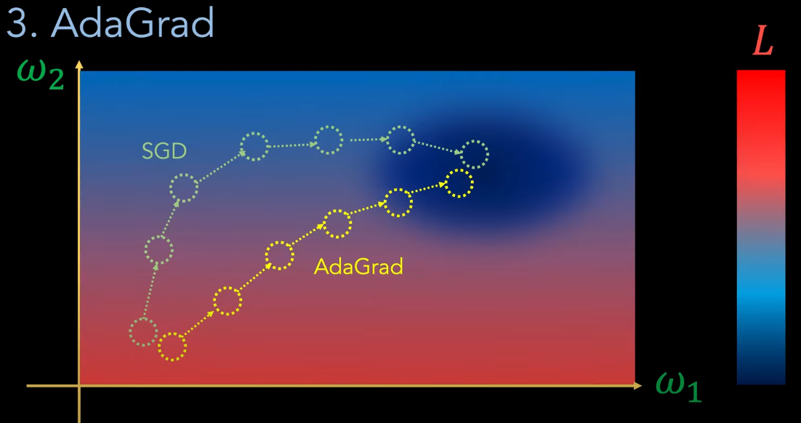
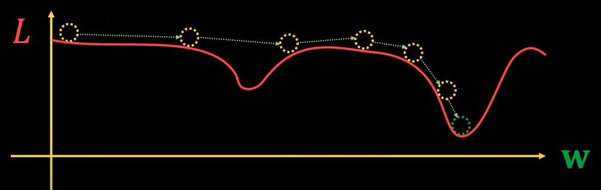
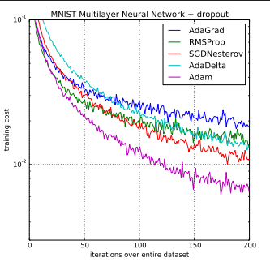

# Optimization for training deep models

The thing with learning neural networks is not just to minimize a function, even though i did pretty much say excactly that before (lol). I mean in practice it is but in actuality, we are trying to learn from data that comes from a real world distribution, which is unknown.

What we essentially do is that we use a surrogate loss (like cross entropy or residuals) which might not excactly match the real world utility (like user satisfaction) and this might actually be a problem. Another problem is that training is essentially done on a sample (validation set) but the real goal is to perform well on unseen data.

so to put it very simply, in machine learning, we are actually just approximating a version of a problem which is much simpler and formal than the real life problem that we actually want to solve.

As we saw in the L2-summary, training deep networks is non-convex, noisy and full of mathematical landmines. this means that we almost never have a situation where we want to minimize loss like in i illustrated in L3-summary. I just do that to make it easier to understand. In reality, computing the gradient descent for a multi-dimensional model with tens and thousands of parameters is extremely computationaly heavy. And this is where the need of optimizing the training process comes in but there are a lot of challenges that we face. lets handle them in this lecture summary and then try to find some solutions for it.

## Challenges

1. **Numerical issues (overflowing and underflowing)**

    Overflowing and underflowing is more of a computational term than a machine-learning-specific term becuase it happens generally when numbers become too large or too small for the computer to represent. An example of this is computing for example $e^{1000}$ in a softmax activation fnuction becuase this will just result in *infinity (inf)*. This would be referred to as an overflow. An Underflow is when numbers become too close to 0, like $1*10^300$ and the computers truncates the float down to 0. This can easily happen if we multiply a lot of very small probabilities untill the computer collapses it down to 0.

    This is bad becuase gradients during the training phase become NaN (Not a Number), inf or 0 which breaks learning and makes debugging hard.

2. **Non-convex loss surfaces**

    As we have seen from the L2-summary, we want to minimize the loss function. But the thing is that in deep networks, this function surface will almost always be non-convex. Mathematically, this means that for any two points $x_1$ and $x_2$, the line segment connecting them lies above or on the graph of the function. In practice this means that the surface will always have multiple dips or valleys. In a convex surface, there would only be one valley and we could move from any point to any other point without hitting the surface. 

    

    This is a challenge becuase when we train the model, we want to minmimze the loss function which in laymans terms translates to finding the deepest point of the surface. This means that when we use gradient descent, it is not guaranteed that we will find the global minimum becuase there can be a lot of local minmima points, saddle points or flat areas which means that we need to use some smarter tricks like adaptive learning or something similar.

    here is a good summary of some problems that we can find when trying to find the minimum of a loss surface.

    

3. **Ill conditioning**

    Imagine if the loss surface is long and narrow with steep walls on one side and a gentle slope on the other side then the gradient steps will zig-zag, overshoot in steep directions and barely progress in flat ones. This will make gradient descent very slow and inefficient.

    Mathematically, this means that the ratio of the largest and smallest eigenvalue of the Hessian matrix (second derivative of the loss) is very large. 

    $$K = \frac{largest eigenvalue}{smallest}$$

    so if $k$ is close to 1 we have a well conditioned surface but if its very large its ill conditioned.

    Ill conditioning often stems from poor weight initialization and highly unbalanced feature scales.

4. **Vanishing and Exploding gradient**

    The problem of *vanishing gradients* happen, oftentimes in the weights of the earlier layers of the neural networks. Recall that the Gradient Descent calculates the gradient of the loss in the. Now the problem here is that weights in the earlier stages of the network become really small. When the gradient is calculated it in turn wants to nudge (update) the weight of one edge. But if the gradient is very small, the update of the weight value is in turn also going to be very small so if this new and updated weight is just a small change from its previous value then it will not carry a lot of significance to the later neurons in the network to help reduce the loss, therefore this weight becomes kind of "stuck" and doesent change much and it can impair the netowkrs ability to learn properly.

    The problem of the *exploding gradient* is the exact opposite of this and it happens when the weight of a neuron (often in the early layers) explodes and becomes too large.

    When i say too large or too small in this sence i mean that a large weight is everything over 1 and something small is something close to 0.

    The reason why the weights in the beginning of the network are the ones that usually get effected by this is because the further back in the network a neuron is, the more components we need to use to calculate its own weight. And the more weights we multiply that are smaller than 1, the more rapidly its going to vanish. We also have to take in to account the learning rate which itself is also usually between 0.1 and 0.0001. So this is why the weights at the start of the network are the ones usually effected by this phenomena.

## Optimizations (ways to mitigate the challenges)

1. **Stochastic Gradient Descent**

    Regular Gradient Descent will compute the exact gradient of the loss function using all of the training examples. It will then take a step in the direction of the true gradient. On a plot this will usually look like small incremental steps steadily going down to the minimum of the loss surface.

    

    The steps it makes are small, accurate and smooth and will always point straight toward the minimum. 

    However, *Stochastic gradient descent* uses just one or a few training samples per epoch. Each step here will now be based ona  small slice of the data which will make the SGD less accurate. And in order to make good progress with this noisy data, it often uses a higher learning rate than GD would tolerate and this is why in SGD, each update moves faster but can converge in a noisier way. So instead of making small and accurate steps like GD does, SGDs convergence plot on the surface will look like a drunk man running down a hill

    

    As i said earlier, SGD is usually a bit less accurate. Sometimes, it can happen that it converges to a minimum that is "good enough" but for large models that contain a lof of parameters, it is computationally infeasible to use every single parameter to compute regular GD and we instead want to compute just a slice using SGD instead. And often times, the tradeoff between being a bit less accurate but A LOT faster is usually a tradeoff that developers are willing to accept.

    However, becuase SGD likes to take big jumps like this, it also means that for the **non-convex surface challenge**, SGD can actually help us by taking big leaps that can sometimes help us find a better true minimum if we have a loss surface with a lot of local minima, saddle points and flat regions

    One other important thing to consider about the Stochastic Gradient Descent algorithm is that it introduces a new kind of hyperparameter to our training algorithm, namely the *learning rate*. The learning rate can best be described as **how big of a step we take in the direction of the gradient during optimization**. This learning rate is a coefficient that is directly multiplied by the gradient of the loss and it explicitly controls how long steps the algorithm takes. We denote the learning rate as $\eta$ mathematicall or ´lr´ programatically.

    This is the formal update rule for SGD:

    $$w = w - \eta * \nabla f(w)$$

    This is how high and low learning rate can effect how the SGD algorithm chooses the minimum of the loss surface on a high-level illustration.

    

    As we can see here, both a too high and too low of a learning rate can give bad or good results so we need to do experimentation and testing in order to check which learning rate is best for a certain problem, model and parameters.

2. **Adaptive learning rates (Adagrad, Adam, RMSprop)**

    So as i said in the end of the previous segment, SGD uses something called a learning rate to decide how large steps we make during the updating of the Gradient Descent direction. By default, SGD will be set to a constant coefficient that we just muliply by the gradient of the loss but if we want to optimize this even more, we would probably look in to using some adaptive learning rate that would make the learning rate coefficient $\eta$ change over the epochs or iterations of the gradient descent algorithm.

    There are many different proposed ways of implementing an adaptive learning rate and i will here list them and explain the most common learning rate optimizers that can be used and that are programatically well supported by most major machine learning libraries like KERAS, PyTorch or TF.

    1. **AdaGrad (Adaptive Gradient)**

        AdaGrad will track how often each parameter gets updated and for each parameter it will evaluate whether they need a bigger or smaller learning rate. So for parameters that want to get updated often, they will mostly get smaller learning rates while the parameters that are rarer will get bigger learning rates to kind of force them to update more drastically.

        here is a rough illustration of how AdaGrad may perform over vanilla SGD.

        

        So vanilla SGD may just try to optimize for $\omega_2$ first and then later try to optimize for the $\omega_1$ parameter after it feels like it has completely used up the benefit of optimizing for $\omega_2$ but AdaGrad may take a more direct route becuase it may sense that it has made more progress on the $\omega_2$ parameter so it will scale the learning rate of $\omega_1$ up and scale $\omega_2$ down in order to kind of balance them out and find a more direct route.

        This is good if we have a model with sparse data but will over time slow down too much. The problem with AdaGrad is that since the sum of squares for all past gradients for a given parameter accumulates forever, the learning rate will shrink too much over time and eventually become so small so that training stops

    2. **RMSProp (Root Mean Squared Propagation)**

        What RMSProp fixes over AdaGrad is that instead of summing all past squared gradients, it keeps a decaying moving average over them using a "discount parameter". This makes it so that it when a large gradient is encountered, the learning rate will be scaled down but when a small gradient is encountered, the learning rate will be scaled up

        This means that we keep the benefits of the decaying learning rate that AdaGrad introduces to us without suffering from a permanently decaying rate.

        This means that when the surface is relatively flat, we will make big steps towards the minima but as we enter in to the valley, we will make smaller and smaller steps.

        

        One problem that however RMSprop and AdaGrad will face is that the algorithm can still find itself stuck in an annoying local minimum. This is one of the things that the next optimizer tries to resolve.

    3. **ADAM (Adaptive Moment Estimation)**

        So as we now know, RMSProp uses an exponential moving average (EMA) of squared gradients to scale the learning rate and it helps prevent Adagrads issue of the learning rate shrinking down to zero. However, RMSprop is still noisy becuase it doesent consider the direction of the past updates it has made.

        What ADAM does is that it combines the adaptive scaling from RMSprop but also adds a momentum (directional memory) .

        So what ADAM does is that it keeps an EMA of the gradients but it will then make a bias correction which will prevents initial updates from being too small. This is done to kind of "smoothen" the trajectory of the convergence of the gradient convergence.

        This makes ADAM look very confident if we would have plotted it on a 3D surface becuase it will minimze for the loss the most per iteration and it will make it almost "lock in" on the minimum point instantly without making any hickups. This is what makes ADAM one of the leading optimizers that is used in machine learning algorithms today.

        